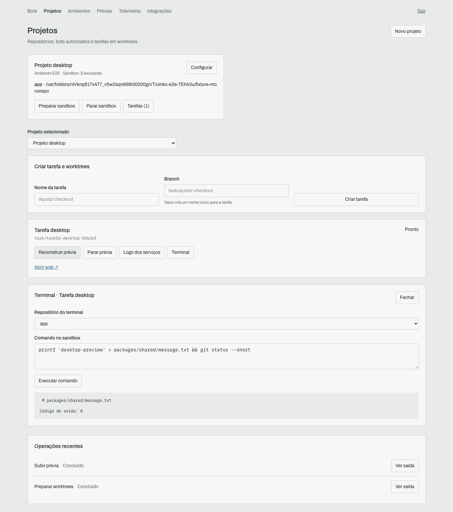
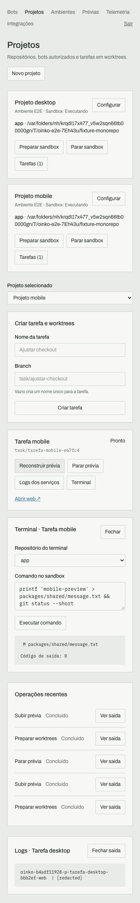

# Entrega: projetos, sandboxes e prévias

Verificação local em 22/09/2026, macOS arm64, Node 22.23.0, Docker 29.7.2 e Compose 5.4.0. Escopo: [blueprint 24](../blueprint/24-workspaces-environments.md) e [ADR 008](../adr/adr-008-local-environments.md).

## Evidências por requisito

| Requisito | Evidência executada |
| --- | --- |
| Cadastro e edição de ambientes, serviços, segredos, projetos e bots autorizados | `apps/dashboard/tests/e2e/workspaces.spec.ts`: formulários reais, editar CPU e referência Git, habilitar programação, selecionar bot e manter segredos existentes. |
| Persistência e conflitos de edição | `packages/workspaces/tests/workspaces.test.ts`, `packages/environments/tests/policies.test.ts` e `service.test.ts`: reabrir SQLite, revisão concorrente, segredo cifrado e DTO sem valores. |
| Monorepo e múltiplos repositórios | E2E monta um monorepo com aplicação em `apps/web` e conteúdo compartilhado em `packages/shared`; `packages/bots/tests/programming.test.ts` cria worktrees reais em dois repositórios. |
| Git e edições isolados do checkout original | `packages/environments/tests/docker.test.ts` e teste de programação: alterar arquivo, commit, branch, ausência de socket Docker, recriar container e conferir dados preservados. A credencial embutida no remote do clone original não é encaminhada. |
| Ferramentas utilizáveis pelo agente e autorização por projeto | Teste de programação passa por `createAgentHost` e pelo ciclo real de tool calling com resposta de modelo simulada; o resultado contém apenas o projeto autorizado. Outro cenário executa leitura, escrita, Git e timeout no Docker e recusa outro bot. Nenhuma chamada paga de modelo. |
| Dockerfile, Railpack e imagem pronta | Builds e execução reais: Dockerfile da aplicação, Redis pronto e Railpack 0.39.0 construindo uma aplicação Node com variável pública de build; resposta HTTP confirma o conteúdo produzido. |
| Compose e desenvolvimento | `compose.test.ts` verifica target/args, seleção de segredos e expansão no container. `docker.test.ts` importa Compose real com dependência concluída, serve código montado e reflete edição sem rebuild. |
| Traefik, troca de worktree, concorrência, parada e dados | Dois conteúdos diferentes servidos por duas prévias reais. Parar uma mantém a outra. Redis preserva valor após parada/reinício. No modo de prévia única, trocar de tarefa mantém o endereço e encerra a anterior. |
| Recuperação e falhas honestas | Reinício real do serviço reconcilia a aplicação e a dependência concluída. Build inválido fica com falha e continua com falha após reiniciar; não confunde o container anterior com um novo build válido. Jobs/tarefas interrompidos são marcados com erro. Testes verificam timeout e distinguem Docker indisponível de container ausente. |
| Limites de acesso | Testes bloqueiam caminhos e symlinks externos, mounts/socket/privilégios no Compose, credenciais na URL Git, chamada sem sessão, mutação de outra origem e projeto não autorizado para o bot. |
| Desktop e tela estreita | Os 18 testes da dashboard passaram. O cenário completo de ambientes passou novamente após ampliar edição/permissões, com viewports 1365×900 e 390×844, prévia aberta no navegador, logs mascarados e parada. Screenshots inspecionados visualmente. Isso não é aceitação em um celular físico. |

## Checks do repositório

- `pnpm typecheck`, `pnpm lint`, `pnpm build`, `pnpm format:check` e `git diff --check`: aprovados.
- `pnpm test`: 1.569 testes aprovados; 6 ignorados nessa execução, incluindo testes Docker/Railpack executados separadamente e um teste anteriormente ignorado no núcleo.
- `pnpm test:coverage`: aprovado; statements do núcleo 92,04%, branches 83,85%, funções 92,76%, linhas 94,03%. Os testes adicionais de disponibilidade do Docker foram executados na suíte final.
- Docker: três cenários de ambientes aprovados; cenário do bot programador aprovado. Railpack: um build/HTTP real aprovado.
- `pnpm lint:dup`, `pnpm lint:deadcode`, `pnpm size`, `pnpm docs:api:check`, `pnpm validate:publish`: aprovados. A duplicação detectada no núcleo permanece abaixo do limite existente.
- `pnpm audit --prod --audit-level=high`: sem vulnerabilidades conhecidas.

Logs completos locais: `.harness/verification/`. Comandos reproduzíveis: [guia operacional](../../packages/environments/README.md).

## Instância local atualizada

A dashboard foi reiniciada na porta 3111, ligada à rede local. O login existente foi aceito e `/bots`, `/projetos`, `/ambientes`, `/previas` e a telemetria responderam HTTP 200. O cliente da dashboard iniciou o gerenciador real sob demanda e consultou seu estado pelo socket privado.

Nenhum projeto de teste foi adicionado ao cadastro do usuário. O Oink LP continua com programação desativada; habilitar a capacidade e escolher projetos são decisões do administrador na dashboard. Dados de testes usam raízes temporárias e são removidos pela suíte. Não houve envio de mensagem ao Telegram.

## Limites deliberados

Os builders entregues são Dockerfile, Railpack e imagem pronta. Nixpacks/CNB são extensões futuras. O uso é local, de um administrador, com socket Unix; não inclui hospedagem multiusuário hostil, publicação na internet, TLS automático ou inicialização no login do sistema. O acesso às prévias no celular depende de rede/DNS alcançáveis; foi verificado no Mac pela interface LAN e em viewport móvel, sem aparelho físico. Repositórios privados podem ser importados de clones locais; credenciais pessoais do host não são encaminhadas automaticamente.

